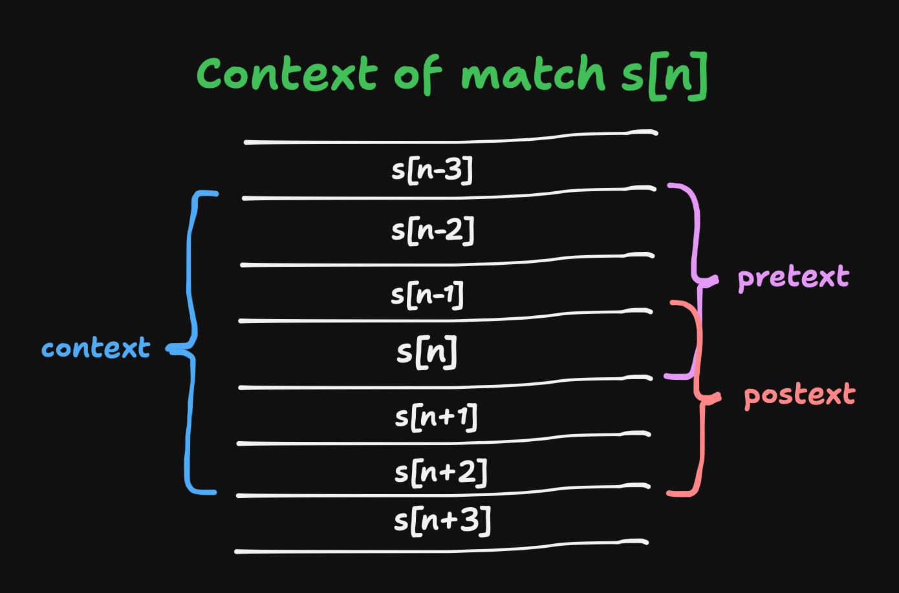

I will soon make a proper release and commit to backwards compatibility.

Before that I am looking for thoughts and feedback, especially on the API and docs.

```clj
no.olavfosse/context {:git/url "https://github.com/olavfosse/context"
                      :git/sha "38e8c66ada9b78e5b582d7523191f840a1afe24b"}
```
---

# Olav's Context Transducers
no.olavfosse/context is a Clojure library providing three transducers
`pretext`, `postext` and `context`. These transducers filter their input
items based on a predicate `pred` such that the items for which `(pred x)` is true
are forwarded as well as the `n` items trailing or leading `x`.

Specifically `pretext` forwards trailing context, `postext` forwards leading context and
`context` forwards both trailing and leading context.



All three functions support the same two arities.

**Span arity:** `(context n pred)`

This forwards the contextualized matches in the form of vector
spans. Each span is a sequence of adjacent items to be forwarded. Note that if the context of two or more matches overlap, they will be delivered in the same span.

```clj
> (into [] (context 2 (partial = 1)) [1 0 0 0 0 0 1 0 1 1 0])
[[1 0 0] [0 0 1 0 1 1 0]]
```

**Separator arity:** `(context n pred separator)`

This forwards the spans directly, without wrapping them in vectors. Each span is separated by `separator`.

```clj
> (into [] (context 2 (partial = 1) :sep) [1 0 0 0 0 0 1 0 1 1 0])
[1 0 0 :sep 0 0 1 0 1 1 0]
```
Note that the separator is considerably more "real-time" in the sense that each match or context item is forwarded immediately, rather than having to wait until the whole vector span is created. For some use cases this matters. This detail is part of the library's contract.

## Examples

**Rich man's grep**

Using `context`, implementing `$ grep -C n regex file` is a one liner:

```clj
> (transduce
   (context 1 (partial re-matches #".*context.*") "--")
   (completing #(println %2))
   nil
   (line-seq (clojure.java.io/reader "readme.md")))
\```clj
no.olavfosse/context {:git/url "https://github.com/olavfosse/context"
                      :git/sha "86173d6cf52c0713867a500aa62c3868c595f659"}
--
# Olav's Context Transducers
no.olavfosse/context is a Clojure library providing three transducers
`pretext`, `postext` and `context`. These transducers filter their input
items based on a predicate `pred` such that the items for which `(pred x)` is true
--

Specifically `pretext` forwards trailing context, `postext` forwards leading context and
`context` forwards both trailing and leading context.

--

**Span arity:** `(context n pred)`

This forwards the contextualized matches in the form of vector
spans. Each span is a sequence of adjacent items to be forwarded. Note that if the context of two or more matches overlap, they will be delivered in the same span.

\```clj
> (into [] (context 2 (partial = 1)) [1 0 0 0 0 0 1 0 1 1 0])
[[1 0 0] [0 0 1 0 1 1 0]]
--

**Separator arity:** `(context n pred separator)`

--
\```clj
> (into [] (context 2 (partial = 1) :sep) [1 0 0 0 0 0 1 0 1 1 0])
[1 0 0 :sep 0 0 1 0 1 1 0]
\```
Note that the separator is considerably more "real-time" in the sense that each match or context item is forwarded immediately, rather than having to wait until the whole vector span is created. For some use cases this matters. This detail is part of the library's contract.
```
